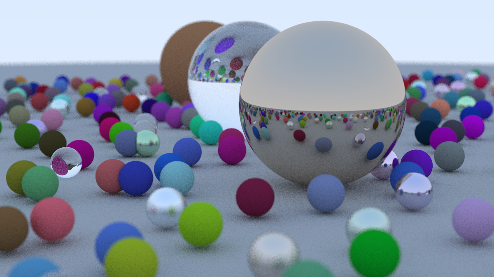

# C++ Ray Tracer

This is a C++ implementation of a simple ray tracer, capable of rendering scenes with various materials and camera effects. The program generates a final image in the PPM (Portable Pixmap) format.

This project is based on Peter Shirley's fantastic book series, "[Ray Tracing in One Weekend](https://raytracing.github.io/)".

## Sample Render



## Features

-   Renderable spheres with diffuse (Lambertian), metal (reflective), and dielectric (refractive, e.g., glass) materials.
-   A configurable camera with adjustable field of view and depth of field (defocus blur).
-   Anti-aliasing through multisampling for smoother edges.
-   A modular and object-oriented design using separate C++ header (.h) and source (.cpp) files.
-   Performance logging using chrono
-   Build automation using a `Makefile`.

## Prerequisites

To build and run this project, you will need:
-   A C++ compiler that supports the C++23 standard (e.g., `g++` or `clang++`).
-   The `make` build automation tool.

These are typically included in build toolchains on macOS, Linux, and Windows (via WSL or MinGW).

## Building the Project

1.  **Clone the repository (if applicable):**
    ```bash
    git clone <your-repository-url>
    cd ray_tracing
    ```

2.  **Compile the code:**
    Navigate to the project's root directory in your terminal and run the `make` command.
    ```bash
    make
    ```
    This will compile all the `.cpp` source files and link them into a single executable file named `ray_tracer`.

## Running the Ray Tracer

1.  **Execute the program:**
    The program writes the image data directly to a new file 'imagefile.ppm'. Give the first arguement to decide number of sub samples for each pixel. More sub samples imply better quality, and higher rendering times.

    ```bash
    ./ray_tracer 30
    ```

2.  **Be patient...**
    Rendering can take anywhere from a few seconds to several minutes, depending on the scene complexity, image resolution, and your computer's performance.

## Viewing the Output

The output file, `imagefile.ppm`, is a simple, uncompressed image format.
-   **On macOS:** You can open `.ppm` files directly with the built-in Preview application.
-   **On Linux:** Many image viewers like Eye of GNOME or Gwenview support the PPM format.
-   **On Windows:** You may need a third-party application like [GIMP](https://www.gimp.org/) or [IrfanView](https://www.irfanview.com/) to view the image.

## Cleaning Up

To remove the compiled object files (`.o`) and the dependency files (`.d`), you can run the `clean` command defined in the `Makefile`.

```bash
make clean