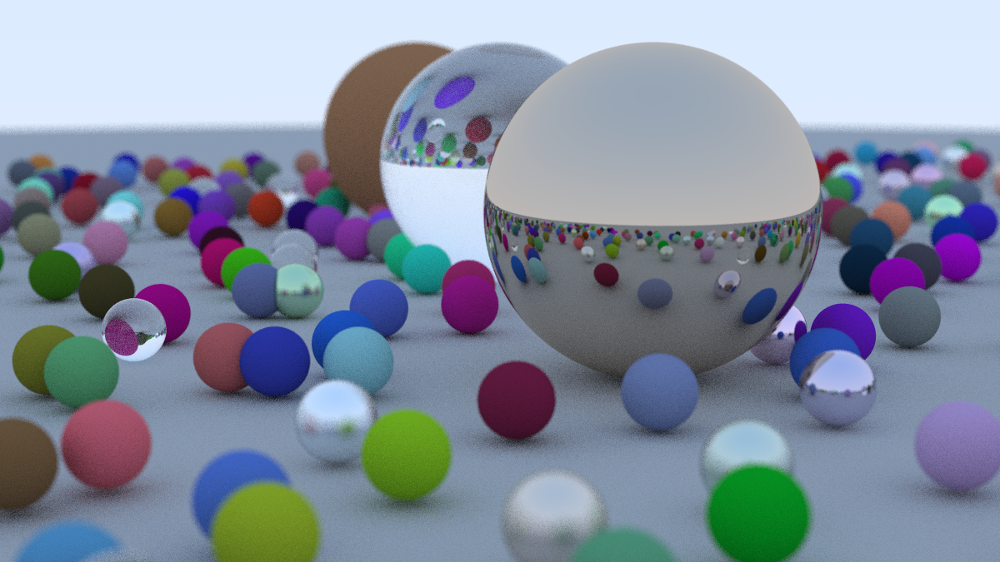

# High-Performance C++ Ray Tracer

This is a C++ implementation of a physically-based ray tracer capable of rendering complex scenes with a variety of materials and camera effects. The program is fully multithreaded to leverage modern multi-core processors, dramatically reducing render times.

This project is based on Peter Shirley's fantastic book series, "[Ray Tracing in One Weekend](https://raytracing.github.io/)".

## Sample Render



## Features

-   **High-Performance Multithreading:** Utilizes a thread pool and a tile-based work queue (`ThreadSafeQueue`) to dramatically reduce render times by leveraging all available CPU cores.
-   **Multiple Material Types:** Supports diffuse (Lambertian), metal (reflective), and dielectric (refractive, e.g., glass) materials for realistic interactions with light.
-   **Advanced Camera Model:** A fully configurable camera with adjustable field of view and depth of field (defocus blur).
-   **Anti-Aliasing:** Produces smooth, high-quality images using multisampling.
-   **Performance Logging:** Uses `std::chrono` to log render times and scene parameters for performance tracking.
-   **Clean, Modular Design:** A well-organized, object-oriented structure using separate C++ header (.h) and source (.cpp) files.
-   **Build Automation:** Includes a simple `Makefile` for easy compilation and cleanup.

## Prerequisites

To build and run this project, you will need:
-   A C++ compiler that supports the **C++20 standard** or newer (e.g., `g++` or `clang++`).
-   The `make` build automation tool.

These are included in build toolchains on macOS, Linux, and Windows (via WSL).

## Building the Project

1.  **Clone the repository (if applicable):**
    ```bash
    git clone <your-repository-url>
    cd ray_tracing
    ```

2.  **Compile the code:**
    Navigate to the project's root directory in your terminal and run the `make` command.
    ```bash
    make
    ```
    This will compile all the `.cpp` source files and link them into a single executable file named `ray_tracer`.

## Running the Ray Tracer

1.  **Execute the program:**
    The program generates an image named `imagefile.ppm`. The first argument specifies the number of samples per pixel—higher values produce better quality images at the cost of longer render times. The second argument specifies the number of CPU cores to be used. To set the number of threads dynamically at runtime, use -1 as second arguement.

    ```bash
    # Run with 100 samples per pixel and 1 thread
    ./ray_tracer 100 1

    # Run with 1000 samples for a high-quality final image and 6 threads
    ./ray_tracer 1000 6
    ```

2.  **Rendering Performance:**
    Thanks to the multithreaded architecture, rendering is significantly faster than a single-threaded approach. However, high resolutions and sample counts can still take from a few seconds to several minutes to complete.

## Viewing the Output

The output file, `imagefile.ppm`, is a simple, uncompressed image format.
-   **On macOS:** You can open `.ppm` files directly with the built-in Preview application.
-   **On Linux:** Many image viewers like Eye of GNOME or Gwenview support the PPM format.
-   **On Windows:** You may need a third-party application like [GIMP](https://www.gimp.org/) or [IrfanView](https://www.irfanview.com/) to view the image.

## Cleaning Up

To remove the compiled object files (`.o`), dependency files (`.d`), and the executable, run the `clean` command:

```bash
make clean
```